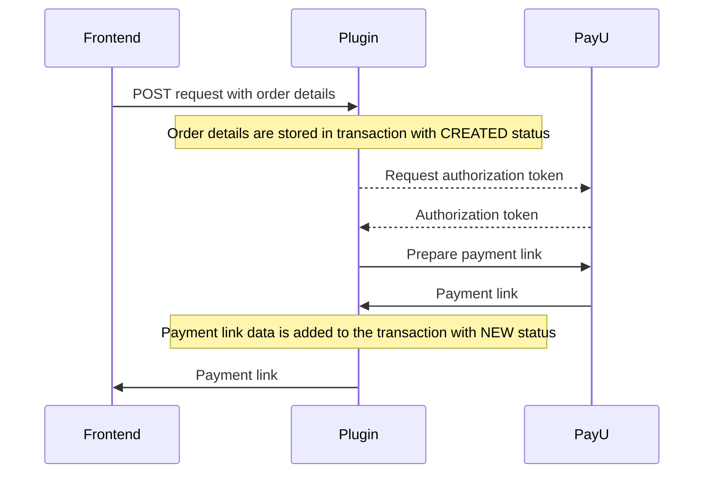

# Strapi plugin payu

## Installation

```bash
strapi plugin add payu
```

## Workflow

### Redirect workflow directly from the frontend


```mermaid
sequenceDiagram
  participant Frontend
  participant Plugin
  participant PayU

  Frontend ->> Plugin: POST request with order details
  Note over Plugin: Order details are stored in transaction with CREATED status
  Plugin -->> PayU: Request authorization token
  PayU -->> Plugin: Authorization token
  Plugin ->> PayU: Prepare payment link
  PayU ->> Plugin: Payment link
  Note over Plugin: Payment link data is added to the transaction with NEW status
  Plugin ->> Frontend: Payment link
```

